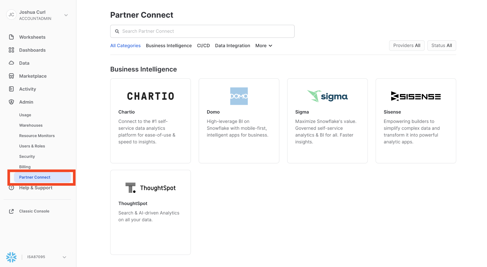
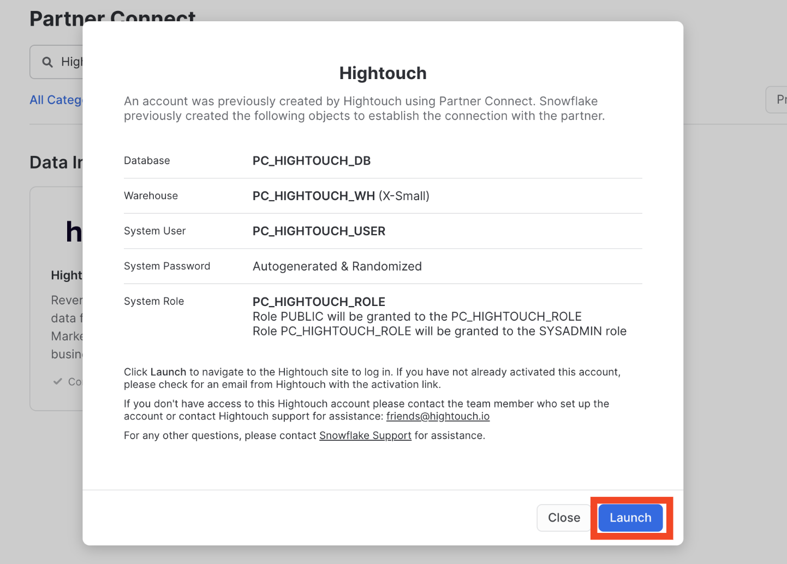
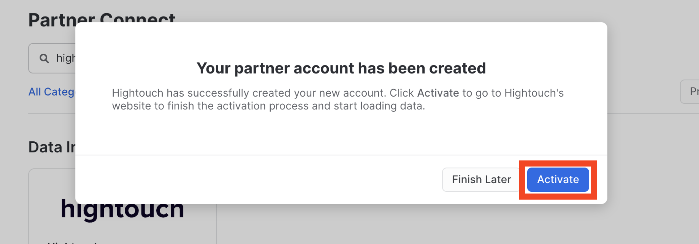

author: Jim Warner
id: suppress_existing_customers_from_youtube_campaign_with_hightouch_and_snowflake
summary: Build and sync an audience of existing customers to Youtube to suppress from future prospecting campaigns, using Hightouch and Snowflake.
categories: Getting Started
environments: web
status: Published
feedback link: https://github.com/Snowflake-Labs/sfguides/issues
tags: Getting Started, AdTech

# Suppress existing customers from a Youtube campaign with Hightouch and Snowflake
<!-- ------------------------ -->
## Overview 
Duration: 1

Hightouch helps businesses sync customer data directly from Snowflake to over 125 different applications. The Data Activation platform, powered by Reverse ETL, provides both SQL and audience builders to help teams across an organization complete what is now being called the "last mile" of the [Modern Data Stack](https://hightouch.com/blog/reverse-etl-bringing-the-modern-data-stack-full-circle).


Audience targeting strategies have become increasingly important in modern marketing due to the rising cost of advertising and the increasing expectations of consumers. While there are many ways in which organizations can target customers, one of the simplest strategies to begin leveraging to optimize advertising spend is suppression audiences. 

A suppression audience is a group of customers who are excluded from a marketing campaign to ensure that they do not see irrelevant ads. Suppression audiences can be created using various segments, such as current customers, churned customers, or those with low purchasing propensity. The idea behind suppression audiences is simple: you define who you do not want to target with your ads. By excluding certain groups from your campaign, you can focus on delivering relevant marketing to your desired audience.

There are several reasons a company might want to suppress or exclude existing purchasers from their ad campaign. Firstly, it may be a product, like a subscription, that can only be purchased once. Another reason is that it may simply be a way to use different messaging for different audiences. Existing customers may be excluded in one campaign and exclusively targeted in another. Finally, it may be a product with a long replenishment cycle, so that purchasers are excluded from messaging for a certain amount of time after their purchase.

In this Quickstart, we will cover this last example, a suppression audience use-case where recent purchasers are added as an excluded (suppression) audience segment in a Youtube campaign run through Google Ads. Leveraging existing customer data in Snowflake, we will build a purchaser audience with Hightouch's no-code audience builder and sync the audience of users to Google Ads.


### Prerequisites
- Basic experience with Snowflake and SQL
- Access to [Hightouch](https://hightouch.com/get-started) with the "audiences" feature enabled. Reach out for a [demo](https://hightouch.com/demo) if needed.

### What You’ll Learn 
- How to create test data in Snowflake
- How to connect Hightouch to Snowflake
- How to create an audience in Hightouch and Sync it to Google Ads
- How to suppress audiences in Google Ads for Youtube campaigns


### What You’ll Build 
- An audience for suppression within Google Ads

<!-- ------------------------ -->
## Prepare your audience within Snowflake
Duration: 4

First, you need to have the data that you want to push prepared within Snowflake.

### Log in to Snowflake

If you already have a Snowflake account, you can use your credentials to log in.  If you do not already have an account, you can visit [https://signup.snowflake.com/]https://signup.snowflake.com/ to sign up for a 30-day free trial.  You will want to make sure that the account you use in Snowflake has the permissions to create a new database, schema, and warehouse to be used by Hightouch.

### Set-up Hightouch through Parner Connect

You can set up a database, schema, and warehouse for use with Hightouch by setting up Hightouch through Partner Connect in Snowsight.  See the [https://hightouch.com/blog/hightouch-snowflake-partner-connect](detailed instructions) on the Hightouch Blog for more details.

1. Click the **Partner Connect** tab under **Admin**.

2. Search for Hightouch (or scroll to the **Data Integration** section), and select it.

3. View the Database, Warehouse, User, and Role that will be created for the integration, and click **Launch**.

4. When the creation is complete, you will see a pop-up telling you that the creation has finished.  Click **Activate** to be taken to Hightouch to log in.

5. Log in to Hightouch using your Hightouch credentials, and you will have a Data Source from Snowflake created in Hightouch.

### Create test data

First, we need to create a database and schema to hold the data.

```sql
CREATE DATABASE HIGHTOUCH_QUICKSTART;
CREATE SCHEMA HIGHTOUCH_QUICKSTART.DEMO;

USE HIGHTOUCH_QUICKSTART.DEMO;
```

Next, we create the customers and sales data, and a view to unify them to make the audience.

```sql
-- create customer list
CREATE OR REPLACE TABLE customers AS
SELECT sha1(seq4()) as user_id,
  'user'||seq4()||'_'||uniform(1, 3, random(2))||'@email.com' as email
  FROM table(generator(rowcount => 100000));

-- verify the data
select * from customers;

-- create random sales for those customers
CREATE OR REPLACE TABLE sales AS
select sha1(uniform(1, 100000, random(3)))::varchar(40) as user_id
  ,dateadd(second, uniform(1, 5256576, random(4)), ('2022-09-01'::timestamp)) as sale_timestamp
  ,uniform(10000,20000,random(5)) as cost_cents
from table(generator(rowcount=>50000));

-- verify the data
select * from sales;

-- create a view for easy lookup
create or replace view customer_sales as
select c.email, max(s.sale_timestamp) as latest_sale, sum(cost_cents)/100 as ltv_dollars
from customers c
 inner join sales s on s.user_id=c.user_id
group by 1;

-- verify the data
select * from customer_sales;
```

Now we need to grant access to the view to Hightouch.

```sql
GRANT USAGE ON DATABASE HIGHTOUCH_QUICKSTART TO ROLE PC_HIGHTOUCH_ROLE;
GRANT USAGE ON SCHEMA HIGHTOUCH_QUICKSTART.DEMO TO ROLE PC_HIGHTOUCH_ROLE;
GRANT SELECT ON VIEW HIGHTOUCH_QUICKSTART.DEMO.customer_sales TO ROLE PC_HIGHTOUCH_ROLE;
```

## Create audience and configure destination in Hightouch
Duration: 8

Now that we have our test data, we need to create the audience in Hightouch and push it to Google Ads.  Connecting to Hightouch from Snowflake above created the data source within Hightouch, which will be used below.

### Creating a Google Ads destination

In order to push data to Google Ads for use with a Youtube campaign, we need to create a destination.

1. Navigate to destinations and click **Add Destination**. Select Google Ads and click **Continue**. (Screenshot)
2. Connect to Google Ads. This will open up a new window to input your credentials. Once done, click **Continue**. (Screenshot)
3. Name the destination and click **Finish**. (Screenshot)

### Create your audience

Next you need to create the audience within Hightouch.

1. Go to the **Audiences** tab and click on **Add audience**.

2. Select the "customer_sales" object, and click **Continue**. (Screenshot)
3. Now you will narrow down the rows in the "customer_sales" table to those who have purchased recently.  Click **Add condition** and select **Have a property**.

4. TODO: this bullet tells you how to narrow on the latest_sale date. (Screenshot)
5. Optionally, you can click the **Preview results** button to view the data that will be included in the audience.  This allows you to make sure the audience is as you expect before you finish creating it. (Screenshot)
6. Click **Continue** to move on to naming your audience. (Screenshot)
7. Set the name of your audience.  For instance, you could name it "recent-purchasers," and click **Finish**. 

### Create a Sync

Now that the audience is created, we need to configure how often it is pushed to Google Ads for use with the Youtube campaign.

1. Click on the "recent-purchasers" audience we created from the Audiences list. Click on the **Syncs** tab and click **Add a sync**. (Screenshot)
2. Select the Google Ads destination that we set up previously. (Screenshot)
3. Map the "email" column in the audience to the destination. (Screenshot)
4. Under "Would you like Hightouch to automatically hash your PII data?" select "Yes, automatically hash PII for me." Then click **Continue** to proceed to setting the schedule. (Screenshot)
5. Here you can select the type of schedule for sending data.  It should be set depending on how often the data changes and the candence of your campaign.  For example, we can select "Interval" and select TODO to sync the data daily.
6. Finally, click **Run** to begin the sync with Google Ads.

## Suppressing audience within Youtube campaign

This section will tell you how to exclude the audience from your Youtube campaign using Google Ads.  For more details, see the [Google documentation](https://support.google.com/google-ads/answer/2549058?hl=en).

1. Click on the **Audiences** tab.
2. Click **Edit Exclusions**.
3. Under the "Exclude from" drop-down menu, select the campaign you want this audience excluded from.
4. Click the checkmark next to the audience that has synced from Hightouch.
5. Click **Save Audience Segment Exclusions**.

<!-- ------------------------ -->
## Conclusion
Duration: 1

Especially in challenging macroeconomic environments, it is important that ad campaigns are targeted to the right people.  In this example, we showed how we could use Snowflake and Hightouch to suppress recent purchasers from an ad campaign running with Youtube.

### What we've covered
- creating test data in Snowflake
- how to connect Hightouch to Snowflake
- how to create an audience in Google Ads from this data
